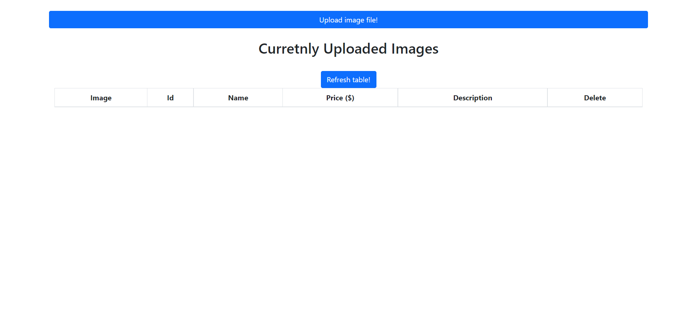
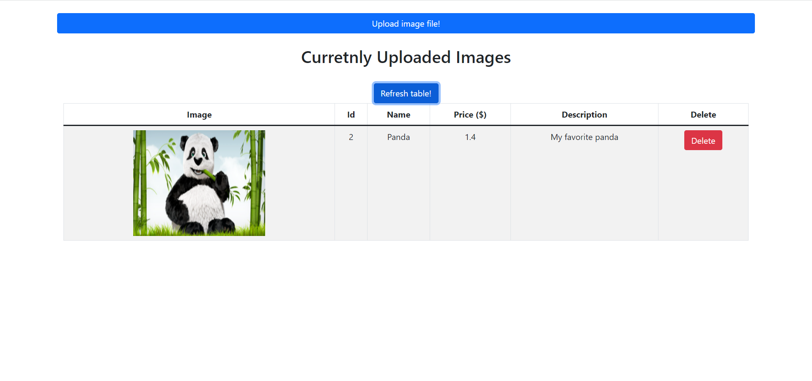
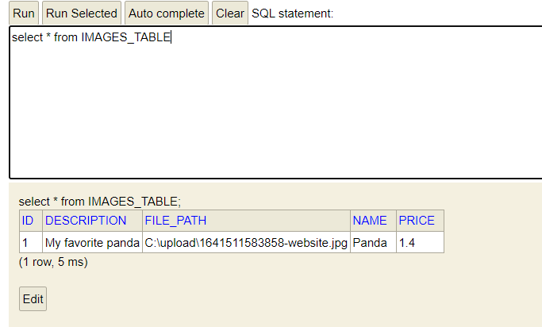

Full stack application that allows users to store and retrieve images to a cloud environemnt. 
Developed frontend using React, bootstrap and axios and backend using the Spring framework.
# Storing images
I decided to store the images in the file system instead of the database for a couple of reasons: 
- database storage is usually more expensive than file system storage.
- web servers etc. need no special coding or processing to access images in the file system.
- Since storing images in databse is slower compared to a file system, the site will be significantly slower when dealing with high traffic.
# Screeshots
## Main page

## Uploading an image

## Uploaded image

## Database after uploading an image

# How to use
(must be on a windows computer)
1. Clone the repository
2. In the frontend folder, run ```npm start```
3. In the backend folder run ```java -jar ImageRepository-0.0.1-SNAPSHOT.jar```
4. From the browser, open "localhost:3000". 
